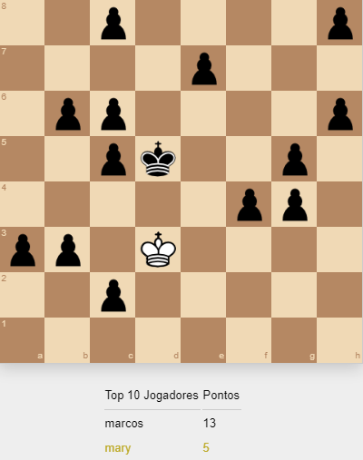

  

## 💻 Projeto
Esta versão do projeto é uma implementação baseada na versão <a href="https://github.com/filipedeschamps/meu-primeiro-jogo-multiplayer/tree/master/playground/pwa-pod">pwa-pod</a>, adicionando os elementos do xadrez: reis, peões, casas protegidas, movimentos em diagonal, etc.

## 🤔 Como jogar

- utilizando as setas direcionais: cima, baixo, direita, esquerda;
- ou as teclas `a`, `s`, `z`, `x` para movimentos diagonais;

 
